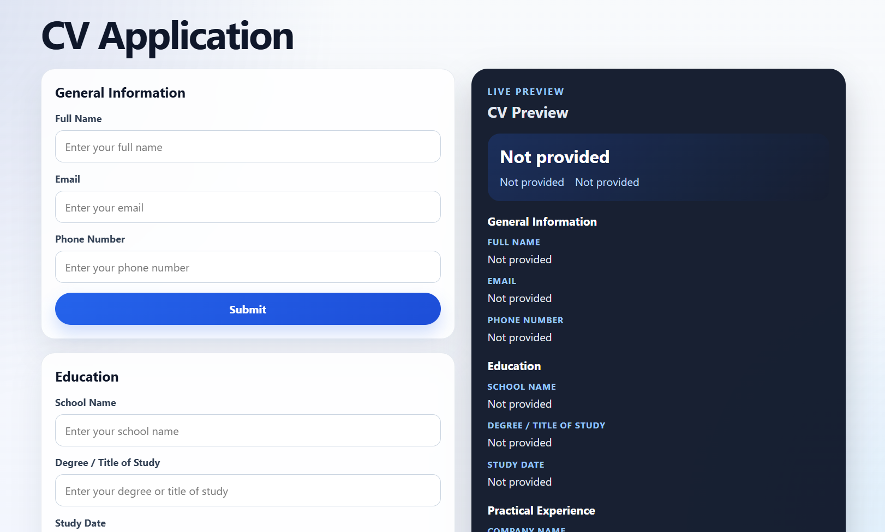

# CV Application

This project is a polished React implementation of The Odin Project "CV Application" assignment. It lets users enter general information, education, and practical experience, then review everything in a clean live CV preview.

## Features

- Functional React components only
- Controlled form inputs with `useState`
- Submit and edit flow for each CV section
- Live CV preview that updates from submitted data
- Responsive two-column desktop layout
- Single-column stacked layout on mobile
- Clean semantic HTML and reusable section cards

## Technologies Used

- React 19
- Vite
- JavaScript
- CSS

## Installation

1. Clone the repository.
2. Install dependencies:

```bash
npm install
```

3. Start the development server:

```bash
npm run dev
```

## Usage

1. Fill out the General Information, Education, and Experience forms.
2. Click Submit on each section to save the data.
3. Use Edit to bring the form back with the submitted values already filled in.
4. Review the live CV preview on the right side of the page.

## Project Structure

```text
src/
├── components/
│   ├── GeneralInfo.jsx
│   ├── Education.jsx
│   ├── Experience.jsx
│   └── CVPreview.jsx
├── styles/
│   ├── App.css
│   ├── CVPreview.css
│   ├── Education.css
│   ├── Experience.css
│   └── GeneralInfo.css
├── App.jsx
├── index.css
└── main.jsx
```

## Learning Outcomes

- Lifting state up to a parent component
- Managing controlled forms in React
- Reusing component patterns without overcomplicating the code
- Building a responsive layout with modern CSS
- Separating presentation styles into focused stylesheet files

## Live Demo

Live demo: [Add your deployed link here]

## Screenshot



## License

This project is open source and available under the MIT License.
